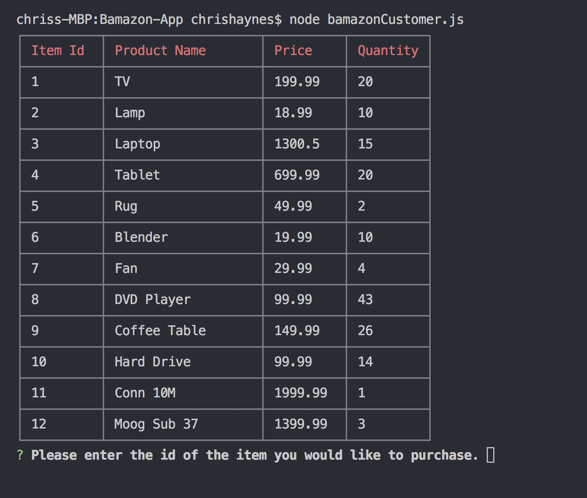
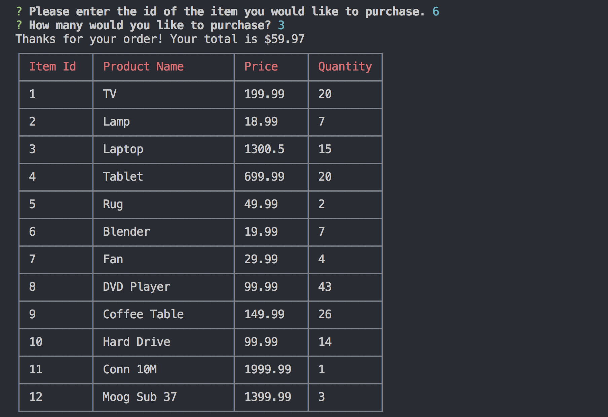
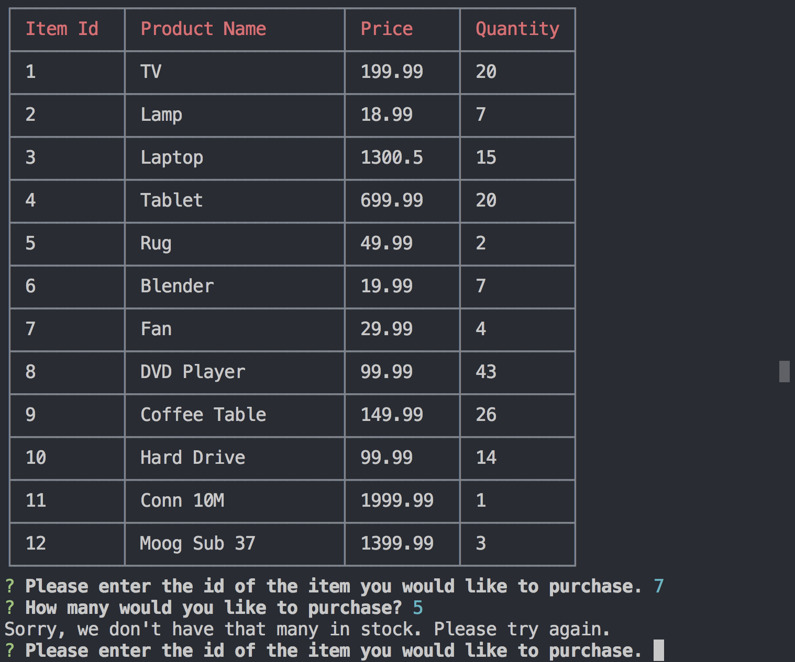
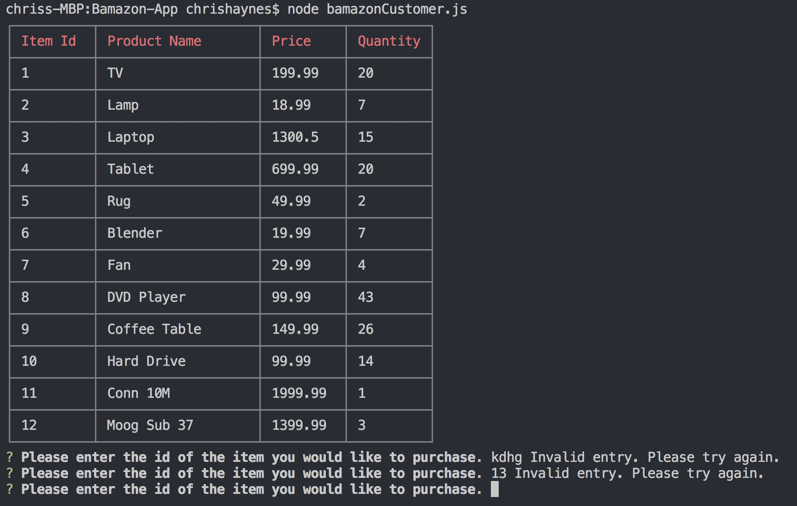
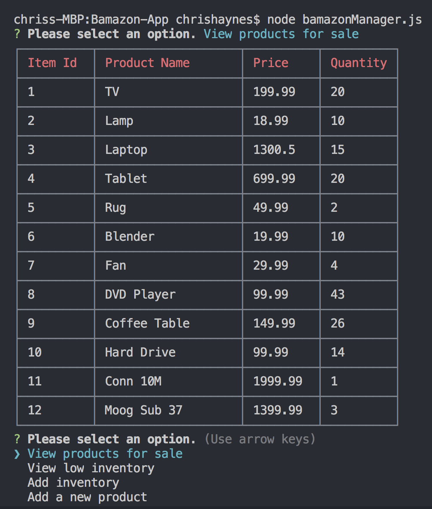
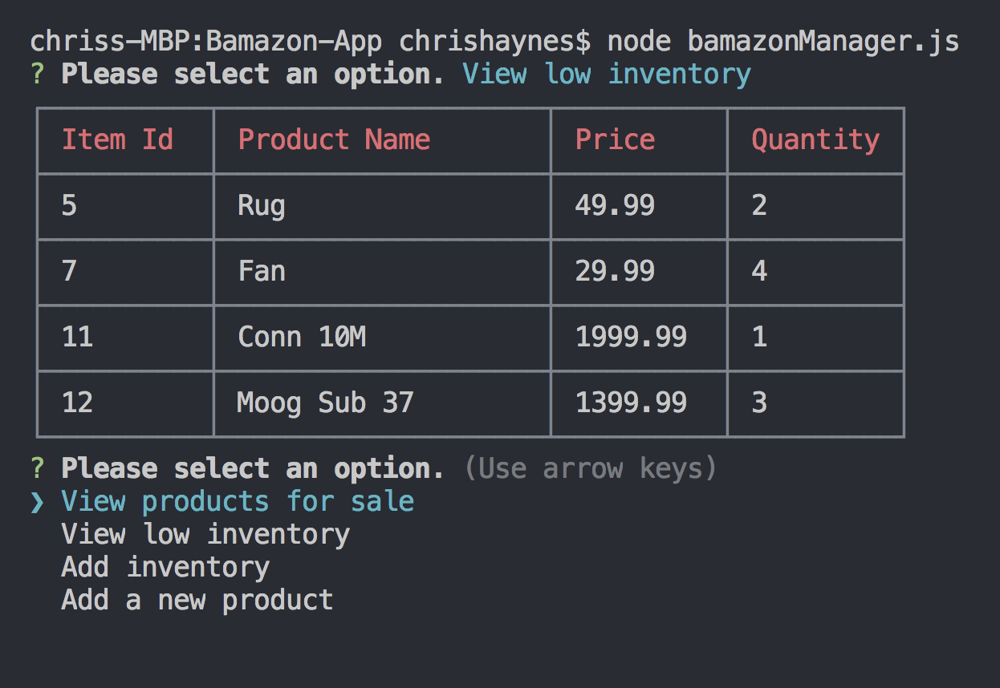
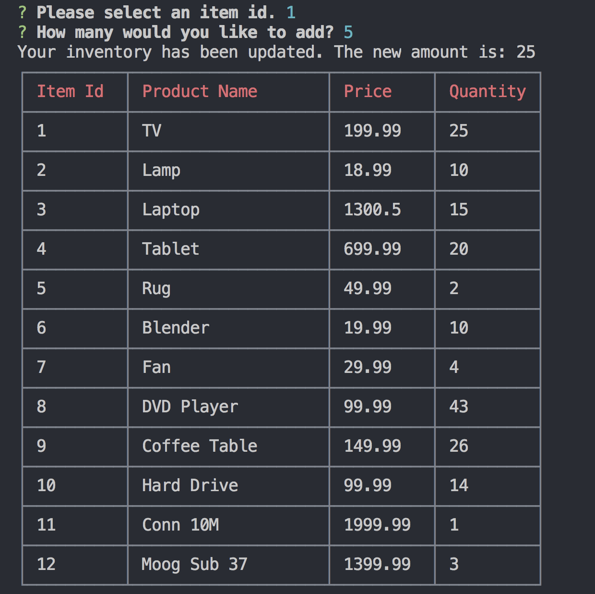
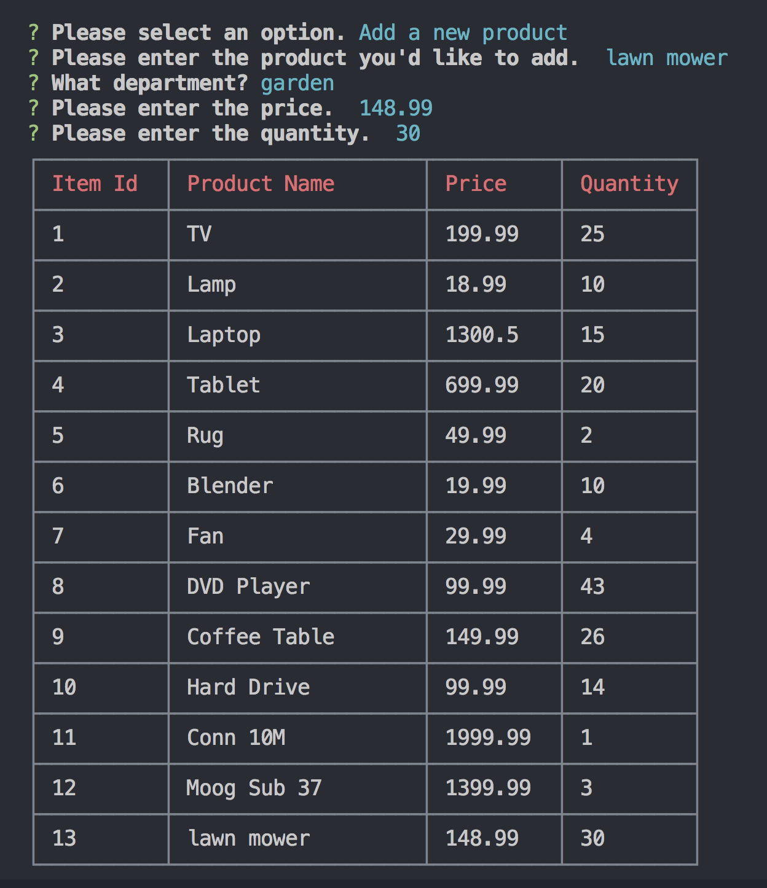

# Bamazon-App
Amazon-like storefront app made with Node.js, Inquier, CLI-Table, and MySQL

This app takes in orders from customers and depletes stock from the store's inventory

When the user runs: node bamazonCustomer.js in their terminal, they are shown a 
table of a mysql database and then given this prompt.

After the user answers which item id they'd like to purchase, the next prompt asks 
how many. Once an amount is chosen, the products database is updated to reflect the 
sale and the customer is given the total price.

The app also deals with orders placed where there is not enough of an item in stock
to fulfill an order.

Additional functionality prevents orders from being placed if the customer inputs an invalid id.

/===============================================================

Running the  manager.js application will:  
List a set of menu options:
View Products for Sale
View Low Inventory
Add to Inventory
Add New Product

If the user selects the first prompt, they will see a table with all available iventory.

If the user selects view low inventory, a table is displayed with all of the stores inventory
with a stock quantity below 5.

If the user selects add inventory, they will be presented a series of prompts.  Their answers 
will be stored and updated in the database.  These new stock quantities will then be displayed 
in a table.

Last but not least, the user may add a new product.  Once again they are given a series of prompts.
These answers are then used to update the database. 

